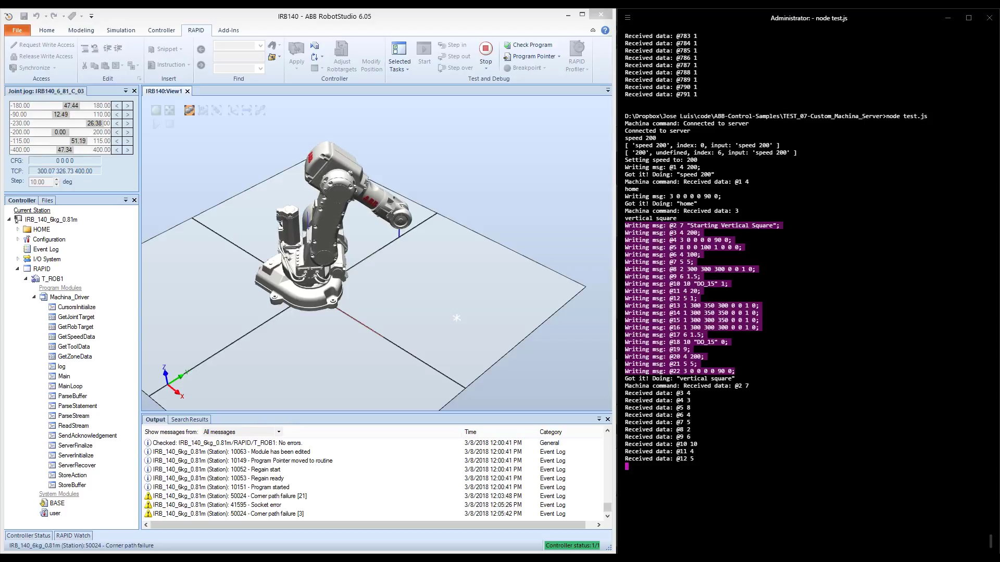

# Machina Driver for ABB Robots

<p align="center">
<a href="https://youtu.be/_o0bgOYMBDY"></a>
</p>

This project contains a series of server modules and utility functions written in RAPID code to allow driving ABB robots from remote clients. This will allow you to send TCP socket messages to the server in the form of a string:

```
@17 1 300 350 400 0 0 1 0;
```

Which will move the robot linearly `1` to XYZ coordinates `300 350 400` in mm with WXYZ quaternion orientation of `0 0 1 0`, with an optional id `17` that will be attached to the server `ok` response when the motion is performed by the robot.

## Disclaimer

__Working with robots can be dangerous.__ Robotic actuators are very powerful machines, but for the most part extremely unaware of their environment; if it collides with something, including yourself, it will not detect it and try to keep going, posing a threat to itself and the operators surrounding it. This is particularly relevant when running in 'automatic' mode, where several security measures are bypassed for the sake of performance.

When using robots in a real-time interactive environment, please make sure:
- You have been __adequately trained__ to use that particular machine,
- you are in __good physical and mental condition__,
- you are operating the robot under the __utmost security measures__,
- you are following the facility's and facility staff's __security protocols__,
- and the robot has the __appropriate guarding__ in place, including, but not reduced to, e-stops, physical barriers, light curtains, etc.

__Machina is in early stage of development.__ You are using this software at your own risk, no warranties are provided herewith, and unexpected results/bugs may arise during its use. Always test and simulate your applications thoroughly before running them on a real device. The author/s shall not be liable for any injuries, damages or losses consequence of using this software in any way whatsoever.

## API

Socket messages to the server must be sent as ASCII strings, following this protocol:

```
[@id ]INST_NUMBER [["StringParam" ]Param1 Param2 Param3 ... Param11];
```

which means:

- `@id`: messages may start with an optional `id` in the form of a `@` character followed by an integer. This `id` will be used to signal completed actions in responses from the server. `@0` is reserved, start with `@1`.
- `INST_NUMBER`: a mandatory integer representing the action to be performed, see below.
- `"StringParam"`: if the instruction requires a string parameter (write a message to the pendant, write to a signal...), the string must go first and encapsulated in double quotes.
- `Param#`: the message may contain up to eleven numerical parameters, representing different information depending on the instruction. Decimal positions, exponentials and negative signs are permitted. It is recommended to stick to five significant digits.
- `;`: a mandatory semicolon as statement terminator.
- Ids, instructions and parameters must be separated by single white spaces.

So for example:

- `@17 1 300 350 400 0 0 1 0;`: move the robot linearly `1` to XYZ coordinates `300 350 400` in mm and WXYZ quaternion orientation `0 0 1 0`, with id `17`.
- `@34 3 0 0 0 0 90 0`: rotate the six robot joints axes `4` to angular values `0 0 0 0 90 0` degrees with id `34`.
- `@485 4 200;`: set linear speed `4` to `200` mm/s with id `485`.
- `7 "Hello Robot!"";`: write in the _FlexPendant_ `7` the message `Hello Robot!` with (no id).

This can be seen working in action here: https://youtu.be/_o0bgOYMBDY

Upon completion of the instruction, the server will respond with an acknowledgement message in the form:

```
>@17 1
```

indicating the id and the number of the completed instruction. Please note that for motion instructions, this may happen slightly before completion of the motion, as the Program Pointer always moves ahead of the Motion Pointer.

The API can be customized via a set of constant declarations on its header, although it is advised to keep it fixed for compatibility reasons:

```
    ! Server data: change IP from localhost to "192.168.125.1" (typically) if working with a real robot
    CONST string SERVER_IP := "127.0.0.1";
    CONST num SERVER_PORT := 7000;

    ! A RAPID-code oriented API:
    !                                         INSTRUCTION P1 P2 P3 P4...
    CONST num INST_MOVEL := 1;              ! MoveL X Y Z QW QX QY QZ
    CONST num INST_MOVEJ := 2;              ! MoveJ X Y Z QW QX QY QZ
    CONST num INST_MOVEABSJ := 3;           ! MoveAbsJ J1 J2 J3 J4 J5 J6
    CONST num INST_SPEED := 4;              ! (setspeed V_TCP [V_ORI V_LEAX V_REAX])
    CONST num INST_ZONE := 5;               ! (setzone FINE TCP [ORI EAX ORI LEAX REAX])
    CONST num INST_WAITTIME := 6;           ! WaitTime T
    CONST num INST_TPWRITE := 7;            ! TPWrite "MSG"
    CONST num INST_TOOL := 8;               ! (settool X Y Z QW QX QY QZ KG CX CY CZ)
    CONST num INST_NOTOOL := 9;             ! (settool tool0)
    CONST num INST_SETDO := 10;             ! SetDO "NAME" ON
    CONST num INST_SETAO := 11;             ! SetAO "NAME" V

    CONST num INST_STOP_EXECUTION := 100;       ! Stops execution of the server module
    CONST num INST_GET_INFO := 101;             ! A way to retrieve state information from the server (not implemented)
    CONST num INST_SET_CONFIGURATION := 102;    ! A way to make some changes to the configuration of the server

    ! Characters used for buffer parsing
    CONST string STR_MESSAGE_END_CHAR := ";";
    CONST string STR_MESSAGE_ID_CHAR := "@";
    CONST string STR_MESSAGE_RESPONSE_CHAR := ">";
```


### Current Limitations

- The `;` character can only be used as statement terminator, nowhere else (including inside string parameters).
- Messages cannot be longer than 80 characters, including statement terminator.
- Use clean formatting: for performance, the parser does not account for preceding, trailing or double spacing in the message.


## Quick Start

### Requirements

You will need a:
- Real or virtual ABB six-axis robot arm with an IRC5 controller.
- The robot needs the `616-1: PC Interface` option.
- Optionally, you may want to also have the `623-1: Multitasking` option for better performance via multithreading.

### Robot Setup
_This section needs improvement, contribute?_

This project contains two versions of the server, `SingleTask` and `MultiTask`, based on availability of `623-1: Multitasking`. Use this guide as a reference on how to install them: https://github.com/robotics/open_abb/wiki/Configuring-an-ABB-Robot-for-OAD

### Client Setup

Connection to the server can be established via any client that supports TCP/IP socketing, adhering to the API format. There are some samples in the folders written in `node.js`.

You may want to check our sibling projects that use this protocols at their core:

https://github.com/RobotExMachina/Machina

## Acknowledgements

Some of the techniques used in this modules were inspired by the amazing work by [Albert Nubiola](https://www.linkedin.com/in/albertnubiola) in [RoboDK](https://robodk.com/), and `open-abb` both in [it's original version](https://github.com/robotics/open_abb) and [Humhu's fork](https://github.com/Humhu/open-abb-driver).

## License
[MIT LICENSE](LICENSE.md)
